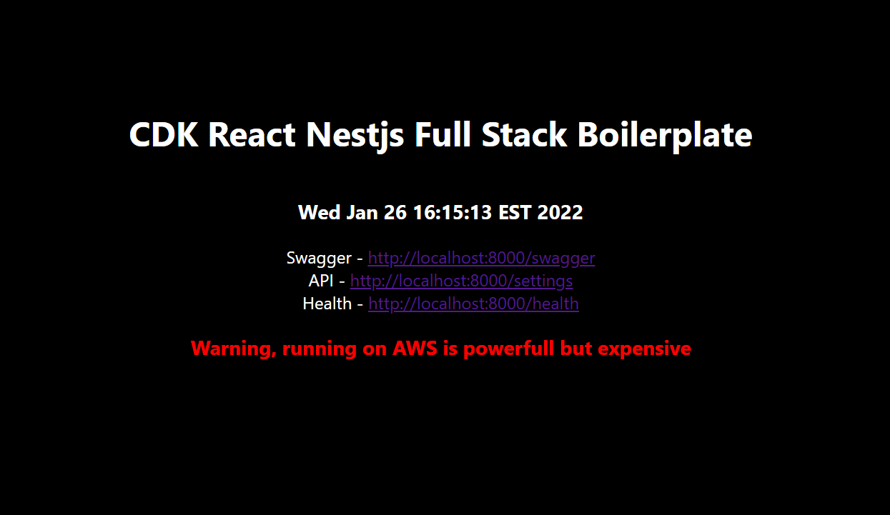

# cdk-full-stack



CDK Full Stack is a boilerplate to deploy a react app, nestjs api using AWS CDK

## Environment vars

You will need to create a .env file in the cdk folder with the following values

```
AWS_ACCESS_KEY_ID=
AWS_SECRET_ACCESS_KEY=
AWS_DEFAULT_REGION=
AWS_CERT_ARN=

CDK_DEFAULT_ACCOUNT=
CDK_DEFAULT_REGION=

DOMAIN_NAME=
```

To set the AWS_CERT_ARN you should create a wild card certificate for your domain using AWS Certificate Manager and use the generated ARN

## Development tools

[ubuntu](https://releases.ubuntu.com) 20.04 - Ubuntu

[node.js ](https://nodejs.org/en/) v16.13.2 - Node.js® is a JavaScript runtime built on Chrome's V8 JavaScript engine.

[docker](https://www.docker.com/) 20.10.10, - Build safer, share wider, run faster: New updates to our product subscriptions.

[docker-compose](https://docs.docker.com/compose/) 1.29.2 - Compose is a tool for defining and running multi-container Docker applications.

[cdk](https://aws.amazon.com/cdk/) 2.9.0 - The AWS Cloud Development Kit (AWS CDK) is an open source software development framework to define your cloud application resources using familiar programming languages

## Development

All development is dockerized and can be easily started by running the following command from the root of the project file

```
npm start
```

Once run docker-compose will configure and run the entire development environment. See /docker-compose-dev.yml for more information

## Deployment

To deploy an updated app can be done by the following

```
cd cdk
./deploy app  # app, app-staging
```

Deleting the app can be done by the following.

<span style="color: red"> WARNING: Destroy will also remove the database</span>

```
cd cdk
./destroy app  # app, app-staging
```
